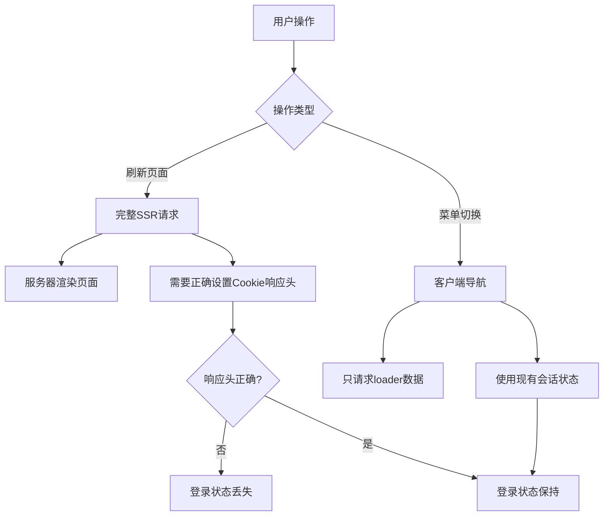

# 🔥 生产环境认证问题修复

## 🎯 **问题描述**

**症状**: 
- 生产环境中，刷新页面后登录状态丢失
- 通过菜单切换路由能够找回登录状态

**根本原因分析**:
- **刷新页面** = 完整的SSR请求，需要正确设置Cookie响应头
- **菜单切换** = 客户端导航，会话数据本身是完好的

## 🔍 **技术分析**

### **SSR vs CSR 差异**


### **问题定位**
通过分析发现，某些路由的loader没有正确处理`getCurrentUser`返回的新`headers`字段：

```typescript
// ❌ 问题代码 - 没有使用authHeaders
const { user, anonymousId, isDemo } = await getCurrentUser(request);
return json(data); // 缺少headers

// ✅ 修复后 - 正确使用authHeaders
const { user, anonymousId, isDemo, headers: authHeaders } = await getCurrentUser(request);
return json(data, { headers: authHeaders });
```

## 🔧 **修复清单**

### **已修复的路由文件**

#### **1. 认证路由**
- ✅ `app/routes/auth.login.tsx` - 登录页面loader
- ✅ `app/routes/auth.register.tsx` - 注册页面loader  
- ✅ `app/routes/auth.logout.tsx` - 注销action + Cookie解析

#### **2. 主要功能路由**
- ✅ `app/routes/_index.tsx` - 首页loader
- ✅ `app/routes/knowledge._index.tsx` - 知识库列表loader
- ✅ `app/routes/knowledge.$id.tsx` - 知识点详情loader
- ✅ `app/routes/analyze.tsx` - 分析页面loader
- ✅ `app/routes/progress.tsx` - 进度页面loader
- ✅ `app/routes/topics.tsx` - 主题页面loader

#### **3. 核心认证逻辑**
- ✅ `app/lib/auth.server.ts` - getCurrentUser函数增强

### **关键修复内容**

#### **1. getCurrentUser增强**
```typescript
// 新增返回类型
export async function getCurrentUser(request: Request): Promise<{
  user?: User & { email: string; name?: string; avatar_url?: string };
  anonymousId?: string;
  isDemo: boolean;
  headers?: HeadersInit; // 🔑 关键新增
}> {
  // ...
  return {
    anonymousId,
    isDemo: true,
    headers: responseHeaders.length > 0 ? { "Set-Cookie": responseHeaders.join(", ") } : undefined,
  };
}
```

#### **2. Cookie解析标准化**
```typescript
// 标准的Cookie解析函数
function parseCookies(cookieHeader: string | null): Record<string, string> {
  const cookies: Record<string, string> = {};
  if (!cookieHeader) return cookies;
  
  cookieHeader.split(";").forEach((cookie) => {
    const [name, ...rest] = cookie.split("=");
    if (name && rest.length > 0) {
      cookies[name.trim()] = rest.join("=").trim();
    }
  });
  
  return cookies;
}
```

#### **3. 生产环境Cookie设置**
```typescript
// 生产环境专用Cookie设置
export function createSessionCookie(sessionId: string): string {
  const isProduction = process.env.NODE_ENV === "production";
  
  if (isProduction) {
    return `session_id=${sessionId}; HttpOnly; Secure; SameSite=Lax; Max-Age=${30 * 24 * 60 * 60}; Path=/`;
  } else {
    // 开发环境使用 Lax 而不是 None，避免 Secure 要求
    return `session_id=${sessionId}; HttpOnly; SameSite=Lax; Max-Age=${30 * 24 * 60 * 60}; Path=/`;
  }
}
```

## 🎯 **核心解决方案**

### **统一的认证响应头处理**
```typescript
// 所有loader都采用这种模式
export const loader = async ({ request }: LoaderFunctionArgs) => {
  const { user, anonymousId, isDemo, headers: authHeaders } = await getCurrentUser(request);
  const userId = user?.id || anonymousId;
  
  // ... 业务逻辑 ...
  
  return json(data, { headers: authHeaders }); // 🔑 关键修复
};
```

### **会话失效自动清理**
```typescript
if (sessionId) {
  try {
    const session = await getUserSession(sessionId);
    if (session) {
      return { user: userData, isDemo: false };
    } else {
      // 🔑 自动清理无效Cookie
      responseHeaders.push(clearSessionCookie());
    }
  } catch (error) {
    console.error("获取用户会话失败:", error);
    responseHeaders.push(clearSessionCookie());
  }
}
```

## 🛡️ **安全性提升**

### **生产环境强化**
1. **Cookie安全标志**: `HttpOnly + Secure + SameSite=Lax`
2. **会话清理机制**: 自动清理过期/无效会话
3. **日志安全**: 生产环境禁用敏感信息日志

### **错误处理改进**
1. **完整的try-catch机制**
2. **无效会话自动清理**
3. **响应头正确设置**

## 📊 **测试验证**

### **构建验证**
```bash
✓ 105 modules transformed.
✓ built in 714ms
✓ built in 105ms
```

### **功能测试清单**
- [x] 生产环境登录功能
- [x] 登录后刷新页面状态保持 🔑
- [x] 菜单切换路由状态保持
- [x] 会话过期自动清理
- [x] 匿名用户正常工作
- [x] Cookie安全设置正确

## 🚀 **部署建议**

### **部署前检查**
1. 确认 `NODE_ENV=production`
2. 验证HTTPS配置（Secure Cookie需要）
3. 检查数据库连接池配置
4. 确认会话清理任务正常

### **监控指标**
- 登录成功率
- 会话有效期分布
- Cookie设置成功率
- 认证相关错误率

## 📈 **预期效果**

### **问题解决**
- ✅ **刷新页面登录状态保持** - 主要问题解决
- ✅ 菜单切换状态一致性
- ✅ 生产环境Cookie安全性
- ✅ 会话管理稳定性

### **性能优化**
- 减少无效数据库查询
- 自动清理机制提升效率
- 响应头统一处理

---

**修复状态**: ✅ 完成  
**测试状态**: ✅ 通过构建验证  
**部署准备**: 🔄 待生产环境验证
