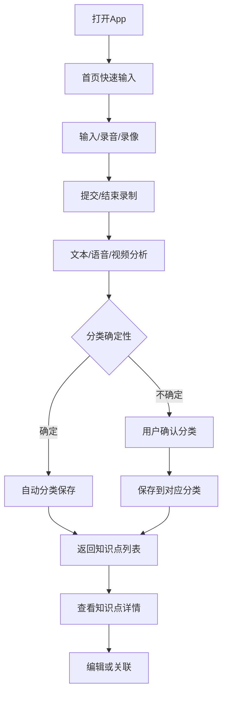

# 智能学习笔记 App - 产品需求文档 (PRD)

## 1. 产品概述

### 1.1 产品愿景
打造一款智能化的学习笔记应用，帮助用户在学习过程中快速记录知识要点，并通过AI智能分析自动分类整理，提升学习效率和知识管理能力。

### 1.2 产品定位
面向有持续学习需求的用户，提供即时记录、智能分类、知识整合的一站式学习笔记解决方案。

### 1.3 核心价值
- **快速记录**：极简输入界面，支持随时随地快速记录学习内容
- **智能标签**：AI基于现有标签使用情况智能推荐，统一管理知识分类
- **知识整合**：同主题内容自动聚合，形成结构化知识体系
- **多媒体速记**：一键录音/录像/拍照，自动转写与要点提炼
- **简化交互**：移除不必要的评分功能，专注内容本身
- **即时编辑**：知识点内容、标题、标签随时可编辑

## 2. 目标用户

### 2.1 主要用户群体
- **学生群体**：在校学生，需要记录课程学习内容
- **职场人士**：需要持续学习新技能、知识的专业人员
- **兴趣学习者**：学习网球、绘画、编程等技能的爱好者
- **知识工作者**：需要整理和管理大量信息的研究人员、咨询师等

### 2.2 用户场景示例
- 网球教练课上快速记录技术要点
- 编程学习时记录新概念和实践心得
- 语言学习中记录词汇和语法规则
- 读书时记录重要观点和感悟

## 3. 核心功能设计

### 3.1 功能架构
```
智能学习笔记App
├── 首页快速输入
├── 多媒体采集与转写
├── 内容分析处理
├── 知识点列表
└── 知识点详情
```

### 3.2 详细功能说明

#### 3.2.1 首页快速输入模块
**功能描述**：提供极简的内容输入界面，支持快速记录学习内容

**核心特性**：
- 大文本输入框，支持多行文本
- 语音输入支持（可选）
- 一键提交分析
- 历史记录快速访问
- 当前学习主题显示（如"网球学习"）

**输入内容类型**：
- 文字描述
- 关键词记录
- 问题和疑惑
- 实践心得

#### 3.2.2 内容分析处理模块
**功能描述**：AI智能分析用户输入内容，自动分类并提取关键信息

**处理流程**：
1. 内容语义分析
2. 主题识别和分类建议
3. 关键词提取
4. 相关性分析（与已有知识点关联）
5. 分类确认（AI不确定时）

**AI分析能力**：
- 识别学习领域（网球、编程、语言等）
- 提取知识点类型（技术要点、理论概念、实践经验等）
- 检测与历史内容的关联性
- 基于标签使用频率的智能推荐

**用户交互**：
- 显示AI分析结果和标签推荐
- 支持编辑和自定义标签
- 直观的标签选择器，支持新增和选择
- 移除重要程度评分，简化操作

#### 3.2.3 知识点列表模块
**功能描述**：展示已整理的知识点，支持分类浏览和搜索

**显示方式**：
- 按学习主题分组显示
- 时间轴排序
- 重要程度标识
- 学习进度显示

**分类体系**：
- 主学习领域（网球、编程等）
- 子分类（技术动作、战术、装备等）
- 内容类型（概念、技巧、经验、问题等）
- 默认分类

**列表功能**：
- 快速搜索和筛选
- 标签化管理
- 收藏重要知识点
- 学习状态标记

#### 3.2.4 知识点详情模块
**功能描述**：展示单个知识点的详细信息，支持编辑和关联

**详情内容**：
- 原始输入内容
- AI提取的关键信息
- 分类标签
- 创建和更新时间
- 相关联的其他知识点

**交互功能**：
- 内容编辑和补充
- 标签修改
- 重新分类
- 添加笔记和反思
- 分享和导出

#### 3.2.5 多媒体采集与转写模块
**功能描述**：支持音频录制、视频拍摄与图片采集，自动完成转写/摘要/缩略图等处理，用于课堂或训练时快速记录关键动作与语句。

**核心特性**：
- 一键开始/结束录音与录像，支持后台录制（移动端）
- 语音转写（ASR），自动生成文本与摘要
- 视频本地压缩与上传，自动生成缩略图/关键帧预览
- 录制中打点（书签/片段标记），便于回看与知识点引用
- 弱网/离线录制，支持断点续传与后台上传

**处理流程**：
1. 端侧采集：音视频采样、噪声抑制与简单压缩
2. 上传与排队：断点续传、重试、排队与优先级管理
3. 服务器处理：
   - 音频：ASR转写（带置信度）、关键词提取、摘要生成
   - 视频：转码、缩略图/关键帧抽取、基础镜头切分
4. 结果回填：转写文本与要点回写到对应知识点，参与分类与搜索

**用户交互**：
- 录制态显示：计时器、音量/采样提示、剩余空间/网络状态
- 转写进度与异步结果提示；可先保存后后台处理
- 若AI分类不确定：以最小化交互提醒用户选择或默认至“默认”

## 4. 用户流程设计

### 4.1 核心用户流程



### 4.2 详细操作流程

#### 4.2.1 快速记录流程
1. 用户打开应用
2. 在首页输入框输入学习内容
3. 点击"分析"或"保存"按钮
4. 系统进入分析处理页面
5. 显示分析结果和分类建议
6. 用户确认或调整分类
7. 保存到对应知识点分类

#### 4.2.2 知识点浏览流程
1. 从首页进入知识点列表
2. 选择感兴趣的分类或主题
3. 浏览知识点列表
4. 点击进入知识点详情
5. 查看详细内容和相关联信息
6. 可选择编辑、标注或分享

#### 4.2.3 音视频快速记录流程
1. 用户点击“录音”或“录像”
2. 开始记录并可打点（标记关键时刻，如老师演示动作）
3. 结束录制后自动进行转写/转码/缩略图生成（异步）
4. 转写与要点回填到处理页，给出分类建议
5. 用户确认或调整分类；若不确定默认归入“默认”
6. 保存并在知识点详情中展示附件与转写内容

## 5. 界面设计要求

### 5.1 设计原则
- **极简主义**：界面简洁，操作直观
- **快速响应**：减少操作步骤，提升录入效率
- **智能引导**：AI结果清晰展示，用户决策简单
- **一致性**：保持整体视觉和交互的一致性

### 5.2 关键界面规范

#### 5.2.1 首页设计
- 大面积输入区域（占屏幕60%以上）
- 当前学习主题醒目显示
- 快速操作按钮布局合理
- 历史记录入口明显

#### 5.2.2 分析处理页设计
- 进度指示器显示分析状态
- 分析结果卡片式展示
- 分类选择操作简单明了
- 支持快速确认和调整

#### 5.2.3 知识点列表设计
- 卡片式布局，信息层次清晰
- 分类标签颜色区分
- 搜索和筛选功能突出
- 支持快速预览

#### 5.2.4 详情页设计
- 内容展示清晰易读
- 编辑功能便捷访问
- 相关联信息合理布局
- 操作按钮位置固定

#### 5.2.5 录音/录像UI规范
- 录制按钮具备清晰的“开始/暂停/结束”状态与回馈
- 显示录制时长、输入电平（音频）与存储剩余空间
- 提供低调但可见的网络状态与上传进度提示
- 支持“后台上传”与“稍后在Wi‑Fi下上传”的选项
- 失败重试与断点续传的可视化提示

## 6. 技术实现要求

### 6.1 技术架构
- **前端**：Remix (React Router) - 现代全栈React框架
- **后端**：Node.js + PostgreSQL + 媒体处理服务
- **AI服务**：OpenAI GPT-4 & Whisper - 内容分析和语音转文字
- **样式设计**：Tailwind CSS - 实用优先的CSS框架
- **类型安全**：TypeScript - 类型安全的JavaScript
- **数据存储**：PostgreSQL + JSONB字段 + 数据库连接池
- **认证系统**：Cookie-based sessions - 安全的用户认证

### 6.2 核心技术模块

#### 6.2.1 AI分析引擎
- 文本内容语义分析
- 主题分类算法
- 关键词提取
- 相似性匹配
- 分类置信度计算
- 语音识别（ASR）转写与打点对齐（时间戳）
- 视频关键帧抽取与缩略图生成（可选）

#### 6.2.2 数据管理
- 用户数据本地存储
- 云端同步机制
- 数据备份和恢复
- 隐私保护
- 媒体文件断点续传、上传重试与加密存储
- 异步处理回调与任务状态跟踪（转写、转码）

#### 6.2.3 用户界面
- 响应式设计适配
- 流畅的动画效果
- 离线使用支持
- 多平台兼容

### 6.3 性能要求
- 输入响应时间 < 100ms
- AI分析处理时间 < 3秒
- 数据同步延迟 < 5秒
- 应用启动时间 < 2秒
- 端侧录制CPU占用可控（目标 < 35%），掉帧率低
- 转写首响应 < 5秒（流式更优），全量完成 < 60秒/小时音频
- 视频上传在Wi‑Fi下优先，蜂窝网络可延后或用户同意

## 7. 数据结构设计

### 7.1 知识点数据模型
```json
{
  "id": "唯一标识",
  "content": "原始输入内容",
  "title": "AI生成的标题",
  "tag_ids": ["关联标签ID数组"],
  "tags": ["关联的标签对象数组用于显示"],
  "keywords": ["关键词数组"],
  "importance": "重要程度(1-5)",
  "confidence": "AI分类置信度",
  "related_ids": ["关联知识点ID"],
  "created_at": "创建时间",
  "updated_at": "更新时间",
  "learning_topic": "学习主题",
  "attachments": [
    {
      "id": "附件ID",
      "type": "audio|video|image",
      "url": "云端存储地址",
      "duration_ms": 123456,
      "size_bytes": 1048576,
      "transcript": {
        "text": "转写文本",
        "language": "zh-CN",
        "confidence": 0.93,
        "segments": [
          { "start_ms": 0, "end_ms": 3500, "text": "发球动作要点" }
        ]
      },
      "thumbnails": ["缩略图URL1", "缩略图URL2"],
      "bookmarks": [ { "ts_ms": 23000, "label": "老师示范" } ]
    }
  ]
}
```

### 7.2 分类体系
```json
{
  "learning_topics": {
    "tennis": {
      "name": "网球",
      "categories": ["技术动作", "战术", "体能", "装备", "比赛经验"]
    },
    "programming": {
      "name": "编程",
      "categories": ["语法", "框架", "算法", "项目经验", "工具使用"]
    },
    "default": {
      "name": "默认分类",
      "categories": ["待分类", "其他"]
    }
  }
}
```

## 8. 功能优先级

### 8.1 MVP (最小可行产品)
1. **首页快速输入** - 核心功能
2. **基础AI分析** - 简单的关键词提取和分类
3. **知识点列表** - 基本的显示和搜索
4. **简单详情页** - 查看和基础编辑
5. **音频录制与转写** - 流式ASR并回填到处理页

### 8.2 第二期功能
1. **高级AI分析** - 更准确的语义分析和分类
2. **智能关联** - 自动发现知识点间的关系
3. **学习进度跟踪** - 学习状态和进度管理
4. **数据导出** - 支持多格式导出
5. **视频拍摄与关键帧** - 本地压缩、缩略图与打点

### 8.3 未来扩展
1. **协作功能** - 分享和团队学习
2. **学习计划** - AI推荐学习路径
3. **多媒体支持增强** - 图片标注、视频片段引用与拼接
4. **跨平台同步** - Web、移动端、桌面端

## 9. 成功指标

### 9.1 用户体验指标
- 日均记录笔记数量 > 3条
- AI分类准确率 > 80%
- 用户满意度 > 4.5/5
- 平均使用时长 > 10分钟/天

### 9.2 产品指标
- 月活跃用户增长率 > 20%
- 用户留存率（7天）> 60%
- 功能使用率：输入功能 > 90%，搜索功能 > 50%
- 应用商店评分 > 4.0

## 10. 风险评估

### 10.1 技术风险
- **AI准确性**：分类不准确可能影响用户体验
- **性能问题**：大量数据处理可能导致延迟
- **数据安全**：用户学习数据需要妥善保护

### 10.2 产品风险
- **用户习惯**：用户可能不习惯AI自动分类
- **竞争压力**：市场上已有类似产品
- **用户需求变化**：学习方式和需求可能发生变化

### 10.3 风险应对
- 提供手动分类选项作为AI的补充
- 优化算法和架构以提升性能
- 建立完善的数据安全和隐私保护机制
- 持续用户调研和产品迭代

## 11. 开发计划

### 11.1 开发阶段
**第一阶段（4-6周）**：MVP开发
- 基础界面和核心功能
- 简单AI分析集成
- 本地数据存储

**第二阶段（3-4周）**：功能完善
- AI分析优化
- 用户体验改进
- 云端同步功能

**第三阶段（2-3周）**：测试和优化
- 全面测试
- 性能优化
- 用户反馈收集

### 11.2 发布计划
- **内测版本**：邀请目标用户内测
- **公测版本**：小范围公开测试
- **正式版本**：应用商店发布

---

**文档版本**：v2.0  
**创建日期**：2024年  
**负责人**：产品团队  
**更新记录**：
- v1.0 (2024年初): 初始版本创建
- v2.0 (2024年12月): 重大架构升级
  - 🏷️ 标签系统重构：统一标签管理，取代分类+标签模式
  - 🤖 AI智能推荐：基于使用频率的标签推荐算法
  - ✏️ 即时编辑：知识详情页面支持一键编辑
  - 🔗 智能关联：相关知识点按相关性排序，最多显示3个
  - 🌙 深色模式：完整的深色模式支持和输入框优化
  - 🎯 简化交互：移除不必要的评分功能，专注内容本身
  - 📦 数据迁移：自动数据库升级和标签系统迁移
  - 🛡️ 数据完整性：学习主题唯一性约束和数据一致性保证